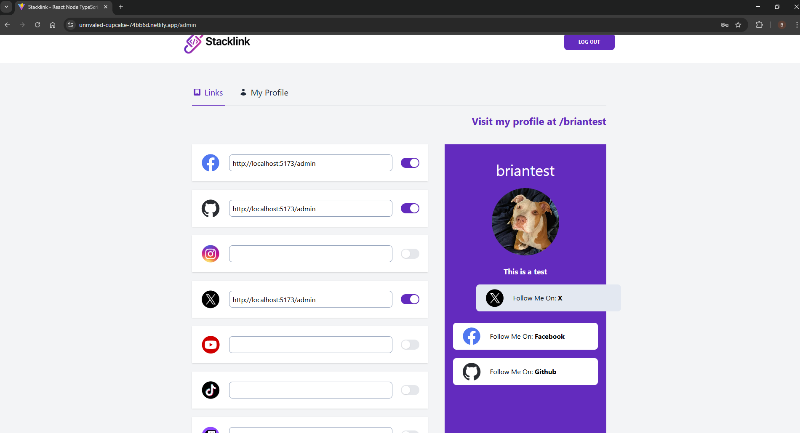
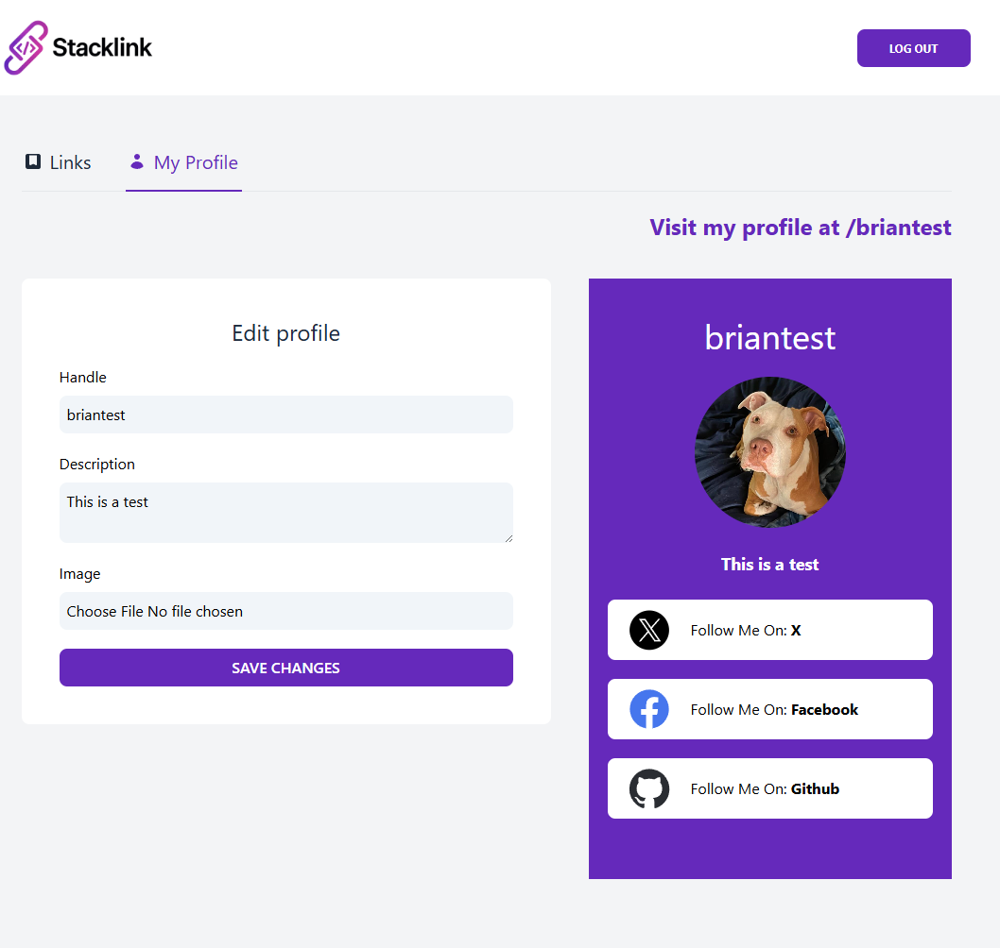
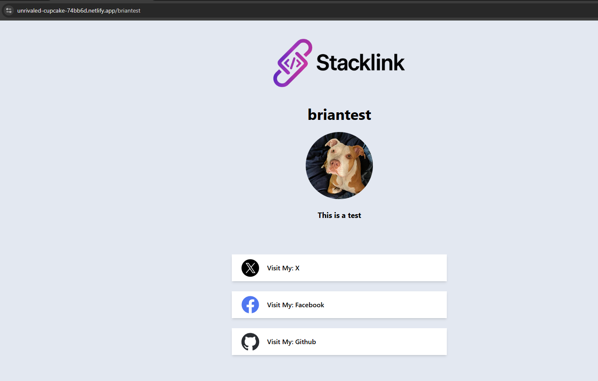
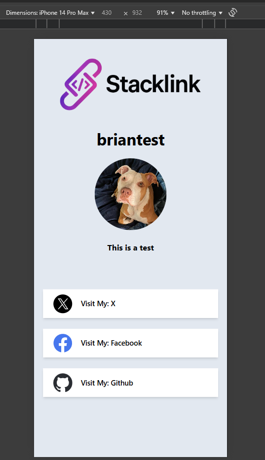

# 🔗 StackLink – A Modern Linktree Clone (Full-Stack MERN + TypeScript)

> 🚀 A feature-rich Linktree-style application built with a modern full-stack stack: React, Express, MongoDB, and TypeScript.

🔗 **Live demo**: [https://unrivaled-cupcake-74bb6d.netlify.app/](https://unrivaled-cupcake-74bb6d.netlify.app/)  
🗂 **Repository**: [github.com/brian-landler/stacklink](https://github.com/brian-landler/stacklink)

---

## 🧠 Overview

**StackLink** allows users to create a personal link page, just like Linktree — complete with social media links, profile image upload, public profile sharing, and an admin dashboard.

This project was built to reinforce my transition into full-stack development using modern frameworks, libraries, and best practices.

### ✅ Core Features

- 🔐 JWT-based authentication
- ✍️ Editable user profile with image upload (Cloudinary)
- 🔗 Add, enable/disable, and reorder social links (with drag-and-drop)
- 🧩 Form validation with feedback
- 🌐 Live public user pages
- 💾 Optimistic updates and caching (React Query)
- 📱 Fully responsive layout with TailwindCSS

---

## ⚙️ Tech Stack

### 🔷 Frontend
- React (Vite)
- React Router
- TailwindCSS
- React Hook Form
- React Query (TanStack)
- Axios

### 🔶 Backend
- Node.js + Express
- MongoDB (Mongoose)
- TypeScript
- Formidable (file uploads)
- Cloudinary (image hosting)
- JSON Web Tokens (JWT)
- Express Validator

---

## 🚀 Project Goals

- Build a realistic full-stack app with clean architecture
- Practice secure user authentication
- Use cloud-based storage (Cloudinary) for profile images
- Handle real-time updates and form feedback cleanly
- Build reusable UI components in a scalable way

---

## 🛠️ Getting Started (Local Development)

1. **Clone the repository**:

    ```bash
    git clone https://github.com/brian-landler/stacklink.git
    cd stacklink
    ```

2. **Set up environment variables** in `backend/.env`:

    ```env
    MONGO_URI=your_mongodb_connection_string
    CLOUDINARY_API_KEY=your_cloudinary_api_key
    CLOUDINARY_SECRET=your_cloudinary_secret
    CLOUDINARY_CLOUD_NAME=your_cloudinary_cloud_name
    JWT_SECRET=your_jwt_secret
    ```

3. **Install dependencies**:

    ```bash
    # Backend
    cd backend
    npm install

    # Frontend
    cd ../frontend
    npm install
    ```

4. **Run the backend**:

    ```bash
    cd backend
    npm run dev
    ```

5. **Run the frontend**:

    ```bash
    cd ../frontend
    npm run dev
    ```

---

## 📷 Screenshots

### 🧑‍💼 Admin Dashboard - Link management


### 🧑‍💼 Admin Dashboard - Profile


### 🌐 Public Profile Page


### 📱 Mobile Layout

---

## ✍️ Author

Built by [Brian Landler](https://github.com/brian-landler)  
If you enjoyed the project, ⭐ the repo and consider connecting with me on [LinkedIn](https://www.linkedin.com/in/brian-landler-a72377b1/)!

---